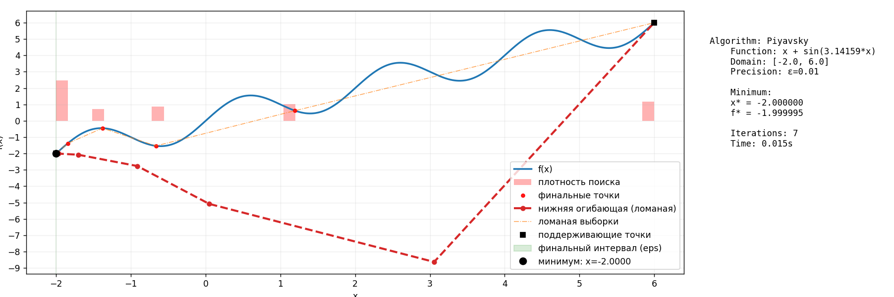
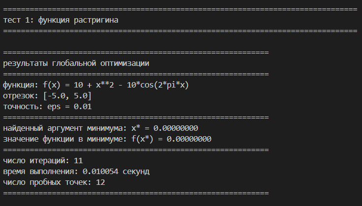
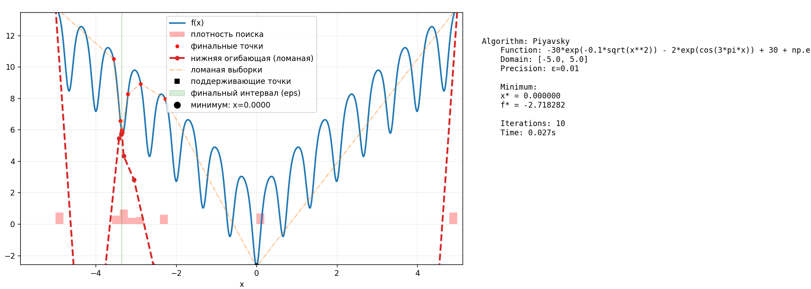
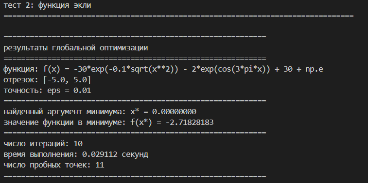
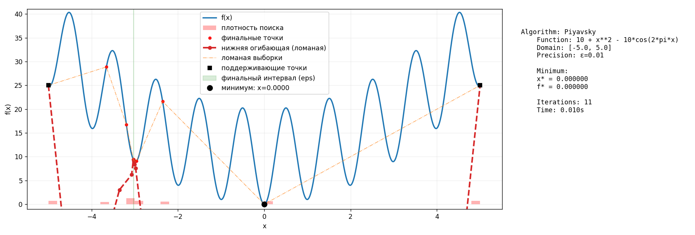
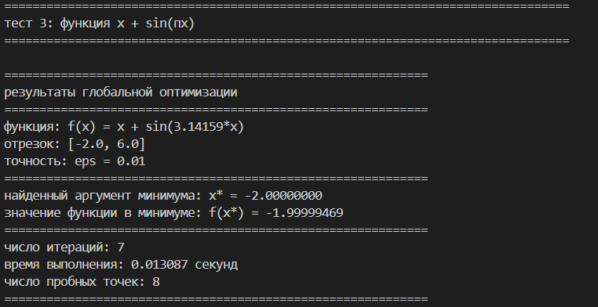

# Global Optimization (1D) — Piyavsky method

Автор: Васильев А. Д.
Поток: К3340

Краткое описание
-----------------
Реализован метод Пиявского (Piyavsky) для поиска глобального минимума одномерной функции, предполагаемой Липшицевой.

Основные шаги
--------------
1. Считываем строковое представление функции и параметры интервала [a, b] и точности eps.
2. Оцениваем константу Липшица L по выборке точек (оценка с запасом).
3. Инициализируем выборку крайними точками и итеративно добавляем точки по Piyavsky:
   - Для каждого интервала (x_i, x_j) вычисляем характеристику R = (f_i + f_j)/2 - (L*(x_j - x_i))/2.
   - Выбираем интервал с максимальной R.
   - Добавляем новую точку x* = (x_i + x_j)/2 + (f_i - f_j)/(2L).
   - Останавливаемся, когда длина лучшего интервала < eps.
4. На каждом шаге поддерживаем набор пробных точек и вычисляем нижнюю огибающую (envelope) l(x)=max_i(f_i - L*|x-x_i|), которую визуализируем как ломаную с острыми углами.

Визуализация
------------
- Синяя плавная линия — исходная функция f(x) (плотный sampling).
- Красная пунктирная линия — нижняя огибающая (ломаная), показывающая область, на которой проводится поиск.
- Оранжевая ломаная — соединение пробных точек по x (демонстрация логики поиска).
- Зеленая область — финальный отрезок, где достигнута точность eps.

Функция Растригина



Функция Экли 



Простая Функция



Запуск
------
В PowerShell:

```powershell
# запуск примера (тесты встроены в файл):
python .\lab2_alt.py

# генерация PDF отчета (объединяет PNG-файлы):
python .\create_report.py
```
